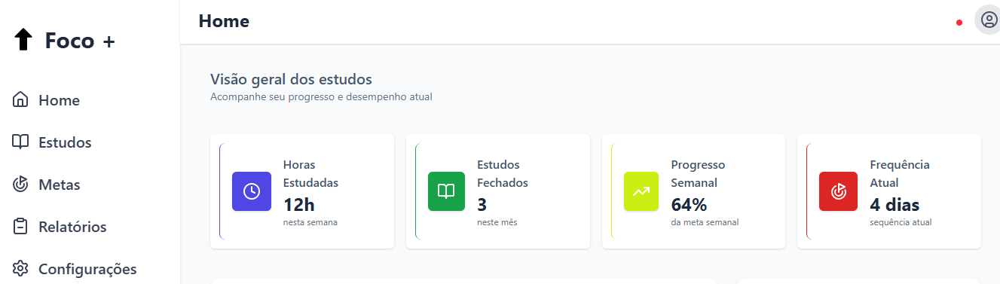
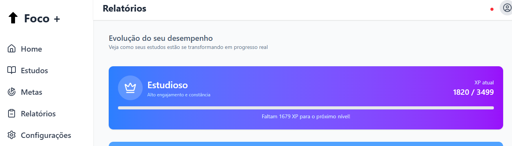

# Foco + 🚀

**Foco +** é uma aplicação web desenvolvida em **Angular** com o objetivo de auxiliar na organização e desafios pessoais, produtividade e acompanhamento de estudos. O projeto foi criado como parte do meu desenvolvimento técnico em Front-end, com foco em **boas práticas, UX e arquitetura escalável**.

---

## Objetivo do Projeto

- Aprimorar habilidades em **Angular moderno (standalone components)**
- Implementar **Reactive Forms** com validações
- Trabalhar estados de UI (edição, loading, feedback)
- Criação de uma base sólida para projetos front-end profissionais
- Propor uma ideia de estudos engajadora para alunos estudarem e se desafiar durante os estudos

---

## Funcionalidades

- Gerenciamento de perfil do usuário
- Edição controlada de dados (Editar / Salvar / Cancelar)
- Campos bloqueados fora do modo de edição
- Persistência de dados com **LocalStorage**
- Feedback visual com **Toastr**
- Interface responsiva
- Micro interações focadas em UX

---

## Tecnologias Utilizadas

- **Angular 21** - framework principal
- **Typescript** - tipagem estática e segurança
- **Standalone Components** - arquitetura moderna de componentes
- **Reactive Forms** - gerenciamento e validação de formulários
- **RxJS** - programação reativa e fluxo de dados
- **Tailwind CSS** - estilização do projeto e design responsivo
- **ngx-toastr** - notificações visuais para feedback do usuário
- **Lucide Icons** - biblioteca de ícones
- **LocalStorage API** - armazenamento de dados no navegador

---

## Arquitetura

- Componentes desacoplados e reutilizáveis
- Services responsáveis apenas pela regra de negócio
- Separação clara entre UI e lógica
- Tipagem forte com interfaces TypeScript

---

## ▶️ Como rodar o projeto

### Pré-requisitos
- Node.js (versão recomendada LTS)
- Angular CLI

---

## Preview da Aplicação


---


### Rodando localmente

A aplicação estará disponível em:
http://localhost:4200

```bash
npm install
ng serve